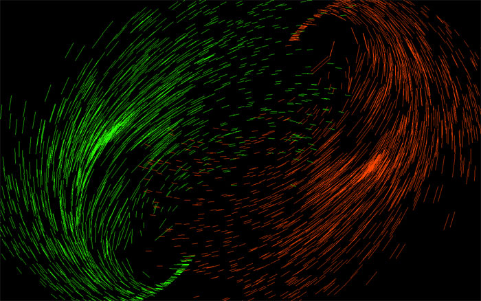

#whirling-rain

A Windows screen saver. 

This is an old program many years ago which was hosted on [sourceforge](http://sourceforge.net). The code might have been lost somewhere in the wild without [sourceforge](http://sourceforge.net). So I want to say: Thank you [sourceforge](http://sourceforge.net)! 

### The JavaScript version
There's a javasript version of it I wrote as a demo program during the [js1k](http://js1k.com/) competition in 2010. The demo site is still accessible: 

[http://js1k.com/2010-first/demo/550](http://js1k.com/2010-first/demo/550)

### Screenshot

